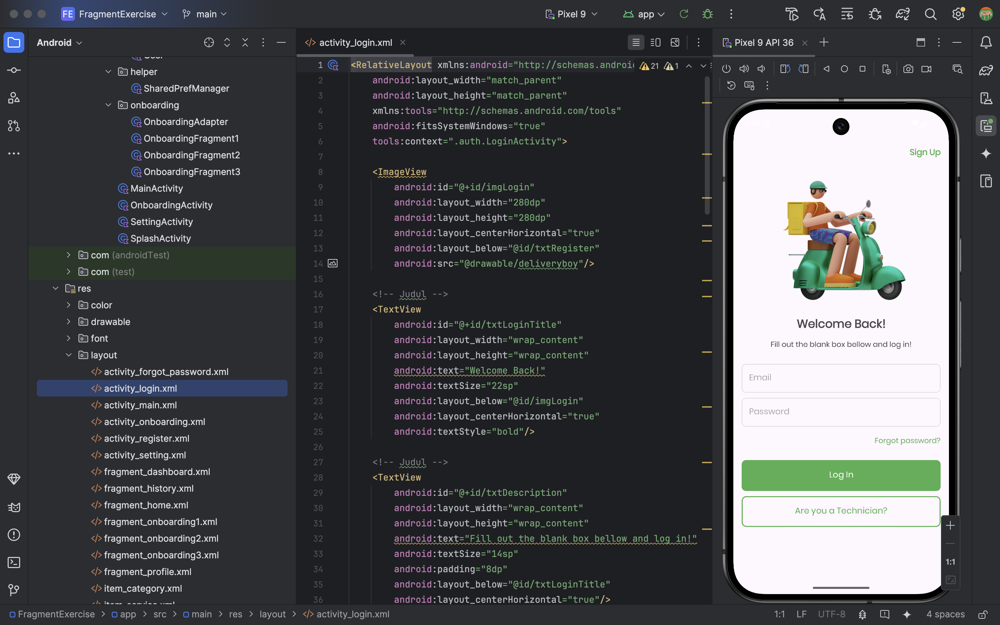

# Adaperlu.id

# Background
Adaperlu adalah sistem yang dikembangkan untuk menghubungkan pengguna dengan penyedia jasa rumah tangga. Layanan yang tersedia mencakup perbaikan genteng, sumur, listrik, dan kebutuhan rumah lainnya.
# Developer
- M. Herdi Al-Fachri
# Technology
- Laravel 12
- Sanctum Library
- PHP
- Kotlin
# Tools & IDE
- Figma
- Android Studio
- Visual Studio Code
- Draw io
